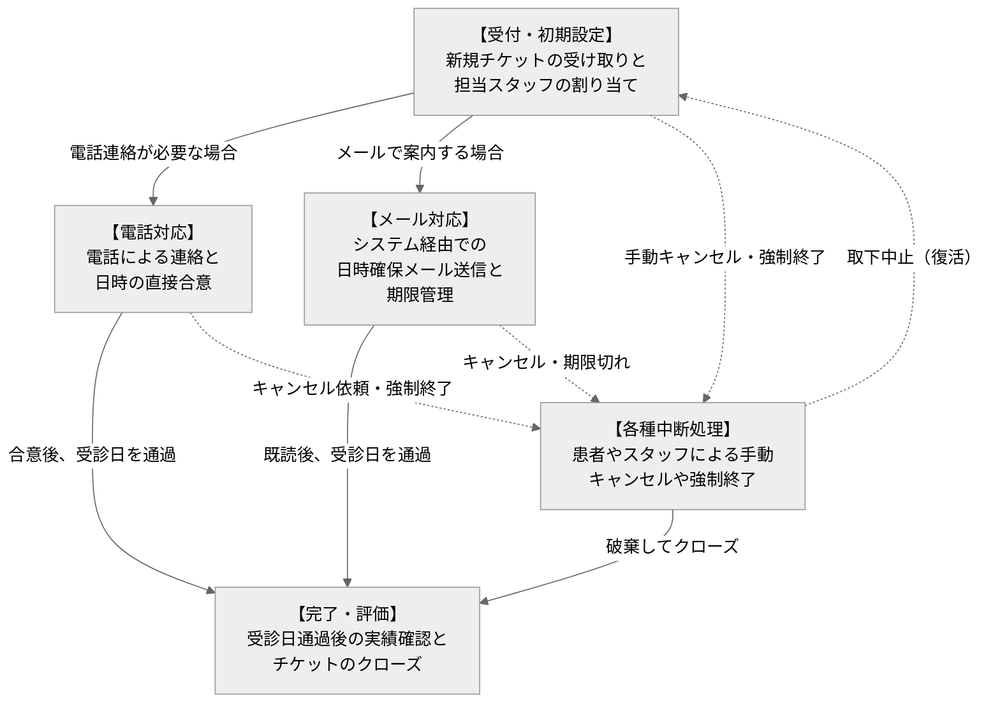
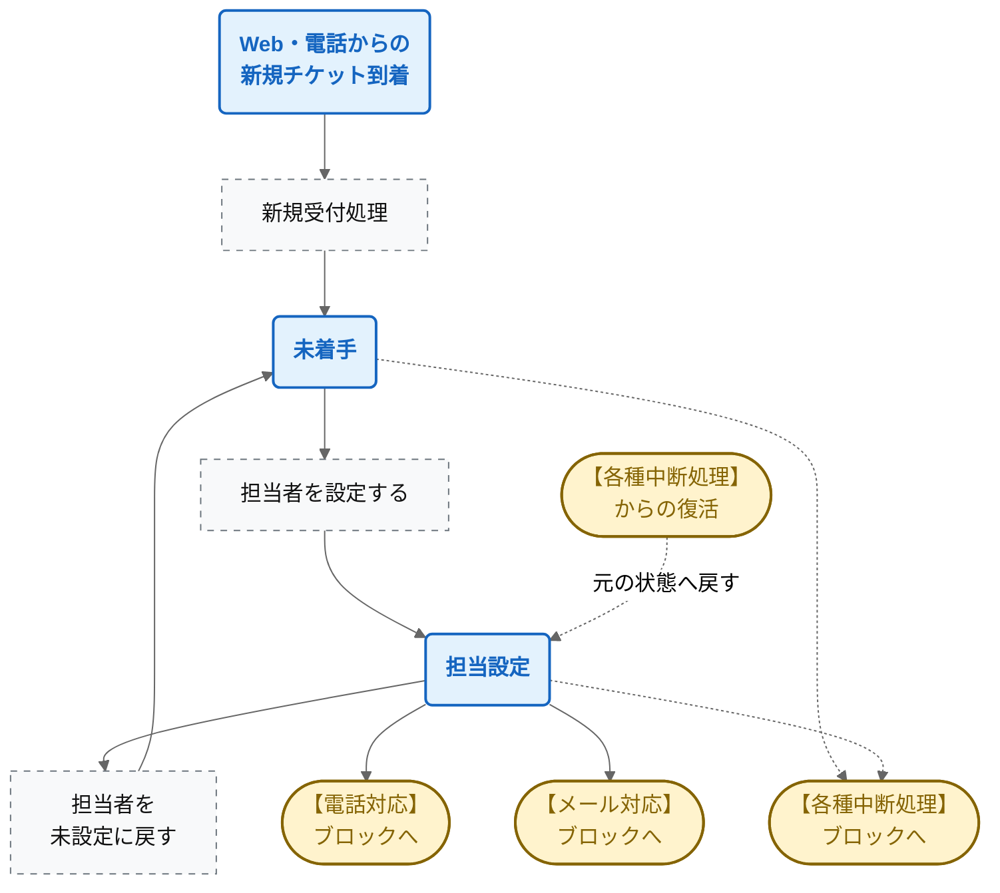
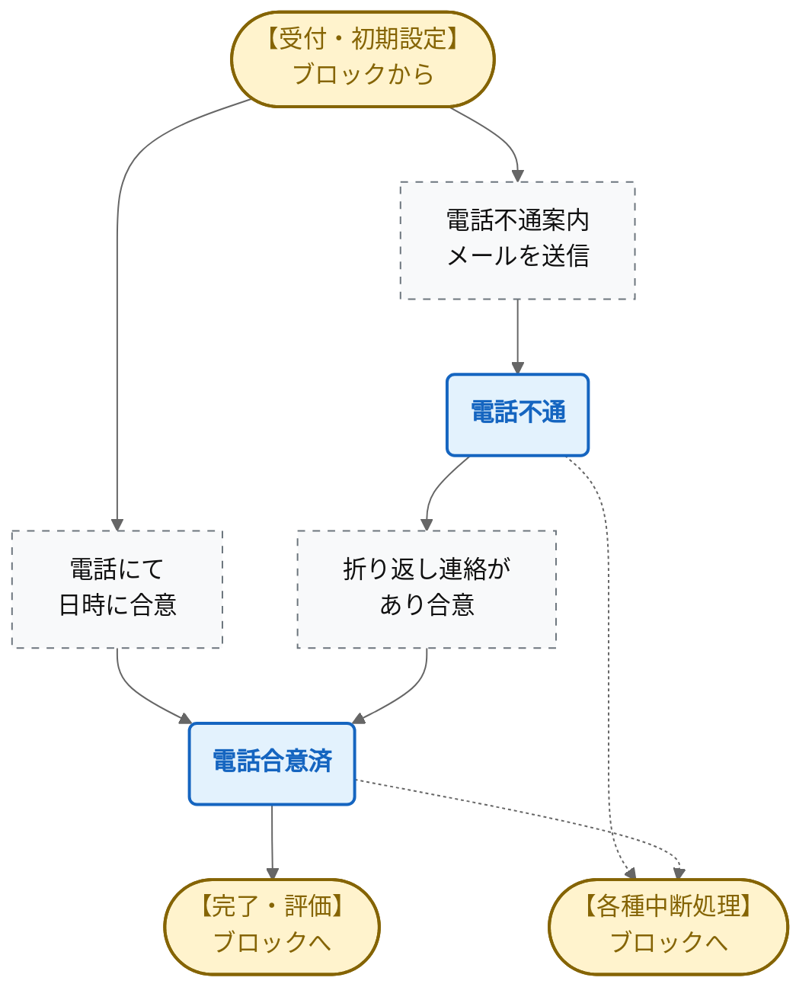
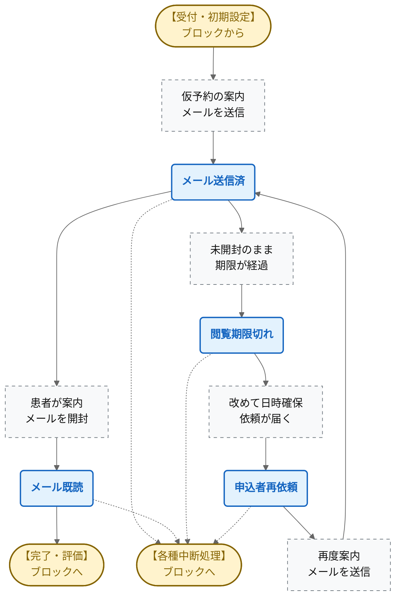
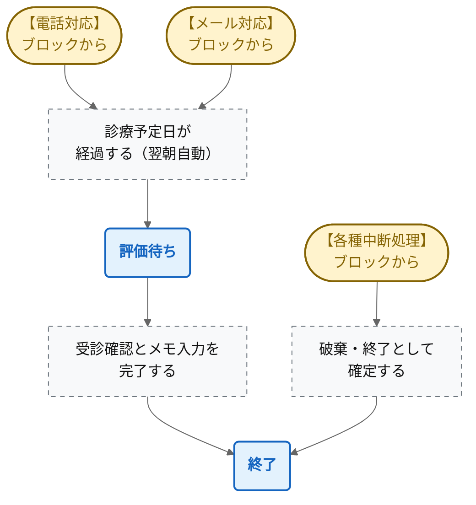
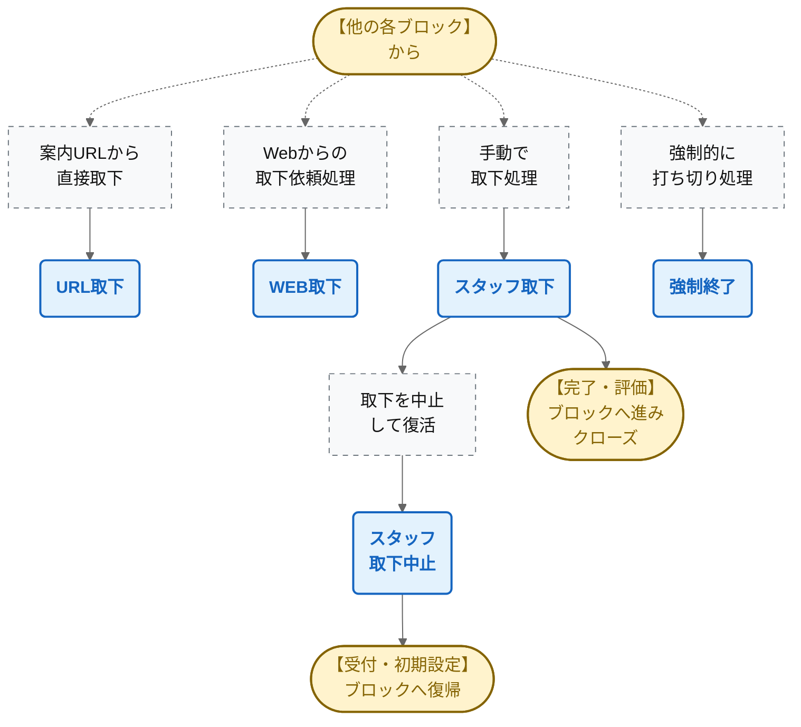

# データフロー図（DFD）形式：予約チケット管理 状態遷移

システム全体が複雑にならないよう、全体を俯瞰する「第1レイヤー」と、各ブロック内の詳細を描く「第2レイヤー」に分けて整理しました。

---

## 【第1レイヤー】機能ブロック間の繋がり（全体俯瞰）
まずはシステム全体がどのようなブロックで構成され、チケットがどう流れていくかの概要図です。

---

## 【第2レイヤー】各ブロック内の詳細フロー

ここから下は、上の5つのブロックそれぞれの内部詳細です。「どの状態」から「どのアクション」を経て遷移するのかを網羅しています。

### 1. 【受付・初期設定】ブロック内のフロー

### 2. 【電話対応】ブロック内のフロー

### 3. 【メール対応】ブロック内のフロー

### 4. 【完了・評価】ブロック内のフロー

### 5. 【各種中断処理】ブロック内のフロー

